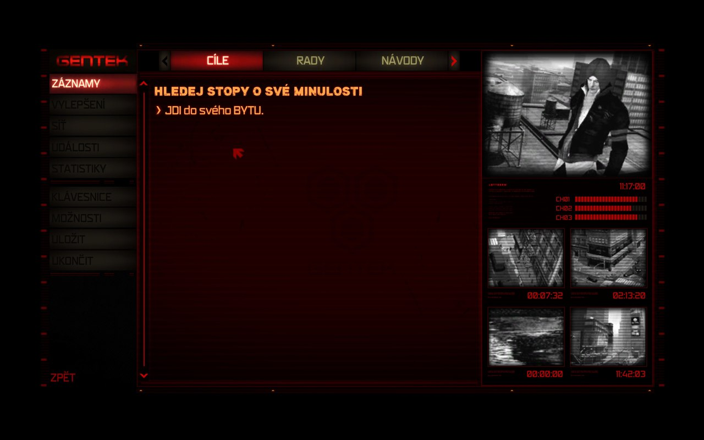
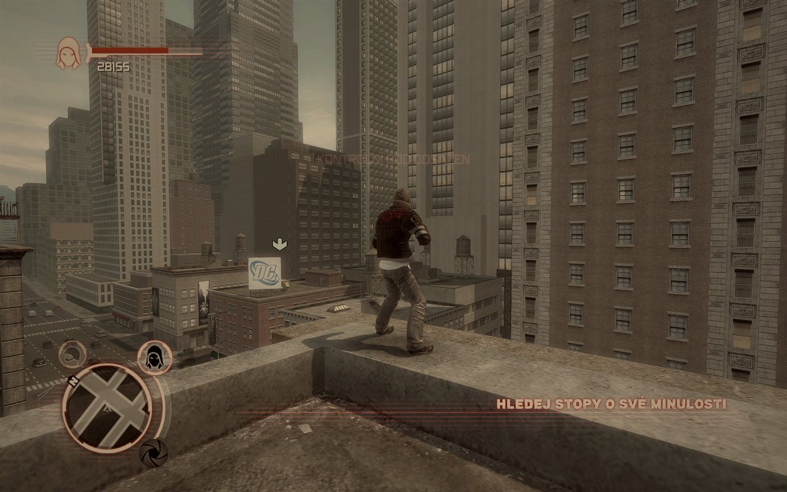
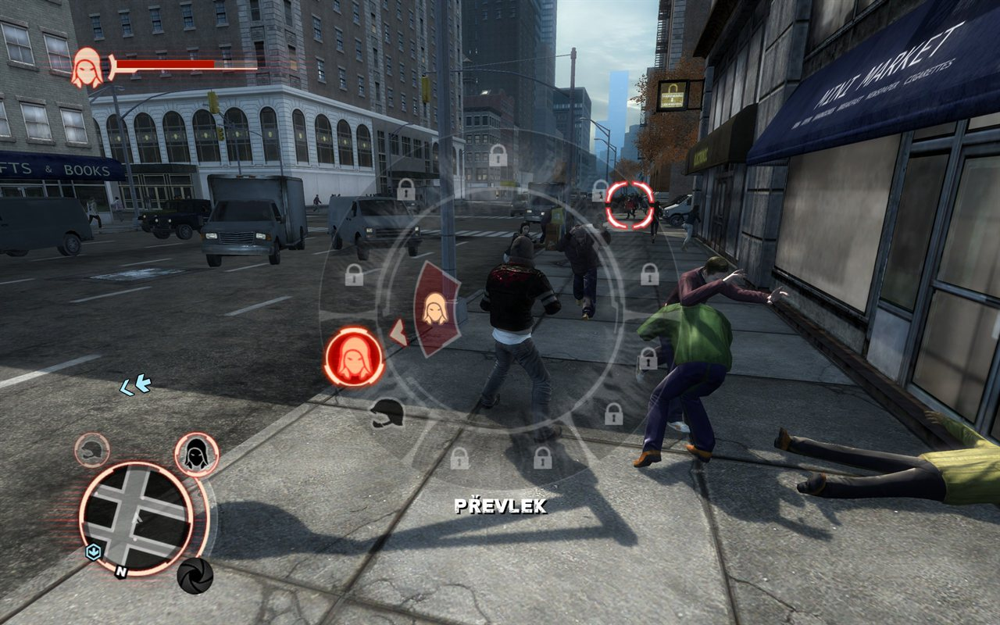
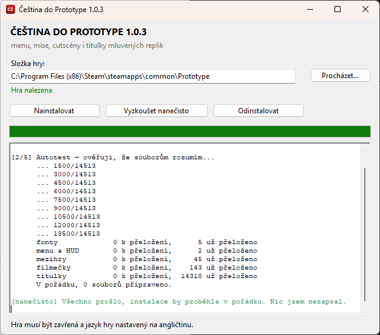

<div align="center">

# Čeština do Prototype

**Kompletní český překlad hry Prototype (2009) včetně diakritiky**

[](https://github.com/ItsEmilyJpg/prototype-cz/releases/latest)
[](https://github.com/ItsEmilyJpg/prototype-cz/releases)
[](https://www.nexusmods.com/prototype/mods/127?tab=description)
[](#instalace)
[](LICENCE.md)
[](LICENCE.md)



### [⬇ Stáhnout češtinu](https://github.com/ItsEmilyJpg/prototype-cz/releases/latest/download/Cestina-do-Prototype.zip)

<sub>Cestina-do-Prototype.zip · 0,6 MB · [všechny verze a změny](https://github.com/ItsEmilyJpg/prototype-cz/releases) · také na [Nexus Mods](https://www.nexusmods.com/prototype/mods/127?tab=description)</sub>

</div>

---

## Co je přeloženo

| | rozsah |
|---|---|
| **Menu, HUD a mise** — cíle, schopnosti, rady, Síť intrik | 3 127 textů |
| **Vnitroherní cutscény** | 325 replik ve 45 scénách |
| **Filmové cutscény a videa Sítě intrik** | 632 replik ve 143 souborech |
| **Titulky ke všem mluveným replikám** | 14 318 souborů |
| **Fonty** — doplněné znaky á č ď é ě í ň ó ř š ť ú ů ý ž | 5 fontů |

Celkem přes 100 tisíc slov. Dabing zůstává anglický.

<table>
  <tr>
    <td></td>
    <td></td>
  </tr>
  <tr>
    <td align="center"><sub>HUD a úkol mise</sub></td>
    <td align="center"><sub>Výběr schopností</sub></td>
  </tr>
</table>

## Instalace

**Potřebuješ:** Prototype na Steamu a **jazyk hry nastavený na angličtinu**
(čeština nahrazuje anglickou jazykovou větev).
[PrototypeFix](https://www.nexusmods.com/prototype/mods/52) je doporučený, ale není podmínka.

1. Zavři hru.
2. Rozbal zip a ve složce **Cestina-do-Prototype** spusť **Cestina-do-Prototype.exe**.
3. Zkontroluj složku hry a klikni na **Nainstalovat**.
4. Hotovo — spusť hru.

Hru na Steamu instalátor najde sám, i v jiné knihovně. Jinou kopii vybereš
přes **Procházet…** nebo přetažením složky do okna.

**Vyzkoušet nanečisto** projde všechny kontroly a nic nezapíše.
**Odinstalovat** vrátí původní soubory.

<p align="center"></p>

## Bezpečnost

- **Nic nezapíše, dokud si není jistý.** Všechny změny nejdřív připraví v paměti
  a zapisuje, až když autotest projde u každého souboru. Na nepodporované verzi
  hry skončí hláškou a nezmění ani bajt.
- **Zálohuje originály** do složky `_cestina_zaloha` uvnitř hry.
- **Sahá jen na texty a fonty.** Mody, PrototypeFix ani ReShade nemění.
- **Neobsahuje soubory hry.** Nese jen český překlad a postup, jak do fontů
  doplnit české znaky.

## Časté otázky

<details>
<summary><b>Windows hlásí „Systém Windows ochránil váš počítač“</b></summary>

Instalátor není digitálně podepsaný, proto ho SmartScreen nezná. Klikni na
**Další informace → Přesto spustit**. Zdrojový kód je v tomhle repozitáři a
instalátor si můžeš [sestavit sám](#sestavení-ze-zdrojáku).
</details>

<details>
<summary><b>Instalátor hlásí, že chybí složka „data“</b></summary>

Spustil/a jsi ho přímo ze zipu. Zip nejdřív rozbal (pravým tlačítkem → **Extrahovat vše**)
a spusť instalátor z rozbalené složky. Složka `data` s překladem musí zůstat vedle něj.
</details>

<details>
<summary><b>Instalátor hlásí, že do složky hry nejde zapisovat</b></summary>

Hra je nainstalovaná ve složce, kam Windows bez práv správce nepustí.
Zavři instalátor, klikni na něj pravým tlačítkem a vyber **Spustit jako správce**.
</details>

<details>
<summary><b>Mám hru z GOGu nebo z krabice</b></summary>

Vyber složku hry přes **Procházet…**. Pokud má tvoje verze stejný formát
souborů, čeština se nainstaluje. Když ne, instalátor skončí hláškou a nic
nezmění — [dej nám vědět](https://github.com/ItsEmilyJpg/prototype-cz/issues)
i s tím, co napsal. Testováno je zatím jen na Steamu.
</details>

<details>
<summary><b>Steam hru aktualizoval a čeština zmizela</b></summary>

Aktualizace přepíše soubory zpátky na anglické. Stačí znovu spustit instalátor —
pozná, co už přeložené je, a doplní jen zbytek.
</details>

<details>
<summary><b>Můžu použít Vortex nebo jiný správce modů?</b></summary>

Ne. Čeština upravuje existující soubory hry, nepřidává nové. Použij instalátor.
</details>

<details>
<summary><b>Jak vznikl překlad?</b></summary>

Formáty hry (P3D textbible, titulky u zvuků, Scaleform fonty) byly zpětně
rozebrány od nuly. Překlad vznikl s pomocí AI podle jednotného glosáře herních
termínů. Ve hře jsou ověřené menu a HUD, zbytek zatím neprošel lidskou
korekturou. Když narazíš na kostrbatou větu, pošli
[issue](https://github.com/ItsEmilyJpg/prototype-cz/issues) — oprava je
otázka jednoho řádku.
</details>

## Pro přispěvatele

| složka | obsah | licence |
|---|---|---|
| [`preklad/`](preklad/) | celý český překlad jako čitelné tabulky ([formát](preklad/README.md)) | CC BY-NC-SA 4.0 |
| [`instalator/`](instalator/) | zdrojový kód instalátoru (C#, .NET Framework 4) | MIT |
| [`sestavit.ps1`](sestavit.ps1) | sestavení instalátoru | MIT |

**Oprava překladu:** najdi větu v `preklad/*.tsv`, uprav třetí sloupec a pošli
pull request nebo issue.

### Sestavení ze zdrojáku

Stačí Windows 10 nebo 11, nic se neinstaluje — kompilátor je součástí .NET Frameworku:

```powershell
powershell -ExecutionPolicy Bypass -File sestavit.ps1
```

Vznikne `build\Cestina-do-Prototype.exe` a vedle něj složka `build\data` s překladem.

<details>
<summary><b>English</b></summary>

Complete Czech translation of **Prototype** (2009, Steam): menus, HUD, missions,
cutscenes, Web of Intrigue videos and subtitles for every spoken line, with Czech
characters added to the game fonts.

Download [Cestina-do-Prototype.zip](https://github.com/ItsEmilyJpg/prototype-cz/releases/latest/download/Cestina-do-Prototype.zip),
(also on [Nexus Mods](https://www.nexusmods.com/prototype/mods/127?tab=description)),
close the game, extract the zip, run Cestina-do-Prototype.exe from the extracted folder and click **Nainstalovat** (Install). The game language must
be set to English. Originals are backed up; **Odinstalovat** (Uninstall) restores them.
The repository contains no game files — only the Czech texts (CC BY-NC-SA 4.0)
and the installer source (MIT).
</details>

---

<sub>Prototype je ochranná známka Activision Publishing, Inc. Tenhle fanouškovský
projekt s Activisionem ani Radical Entertainment nijak nesouvisí a je určený
hráčům, kteří hru legálně vlastní.</sub>
